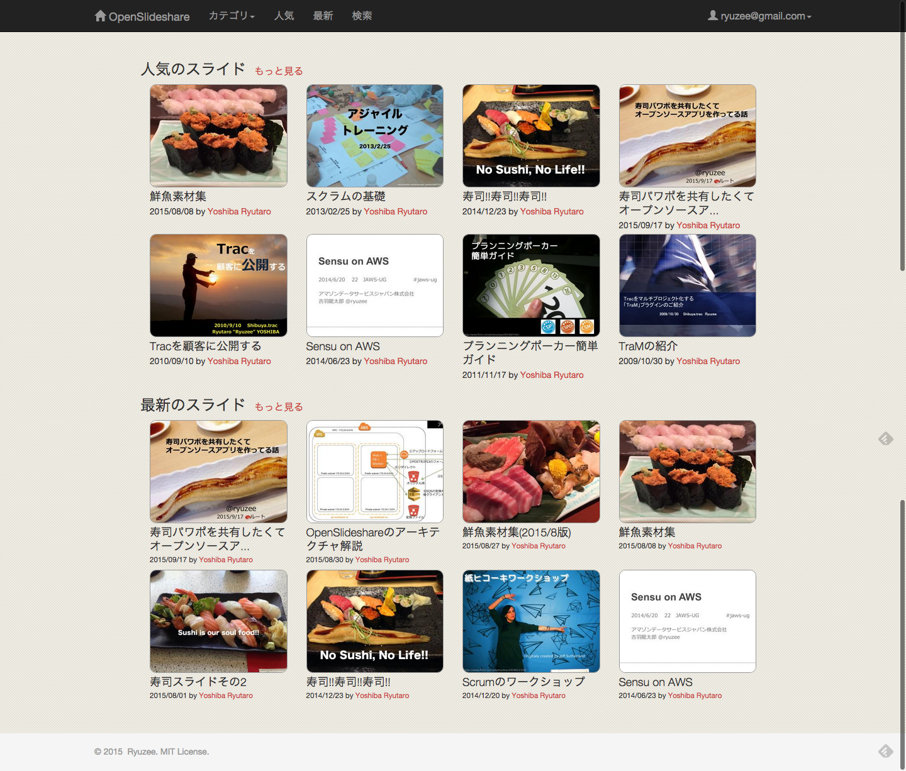
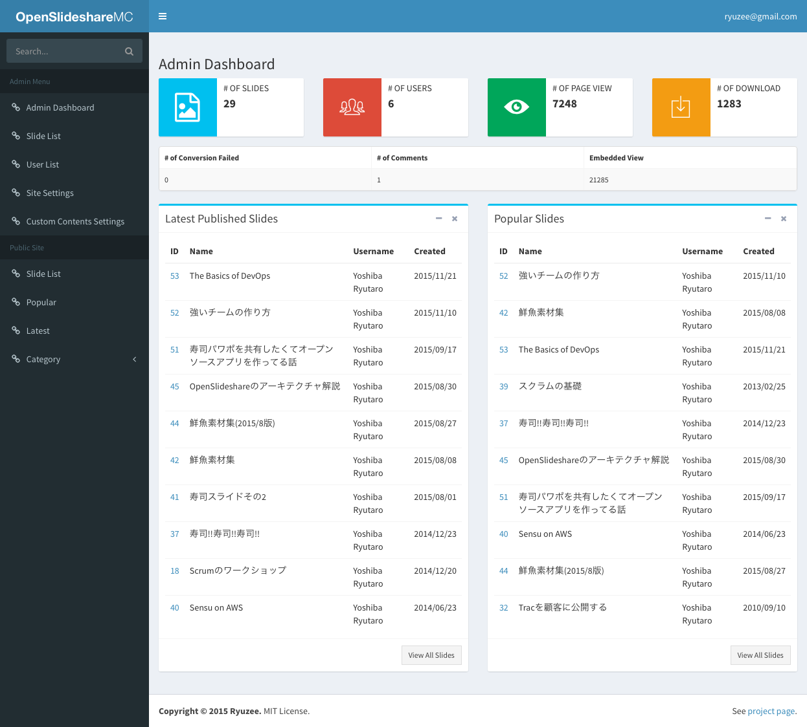

# Open Slideshare [](https://circleci.com/gh/ryuzee/open-slideshare/tree/master) [](https://scrutinizer-ci.com/g/ryuzee/open-slideshare/?branch=master)

*This is simple open source slidesharing application.*

You can see the working demo at http://slide.meguro.ryuzee.com/



## Feature

- Uploading slides (pptx, pdf)
- Listing slides by category, user and so on
- Showing slide without Flash Player
- Showing slide vertically
- Storing all slides in Amazon S3. Thus terribly scalabale
- Searching slides
- i18n
- Responsive design
- Embedded player
- RSS
- Statistics
- Transcript
- Admin Dashboard to overview statistics and edit slides



## Requirements

This application depends on following technologies.

- Amazon S3
- Amazon SQS
- Ubuntu 12 or higher with OpenOffice, xpdf, unoconv and so on

You can use the develop environment here. https://github.com/ryuzee/open-slideshare-environment

It includes Vagrantfile and Chef cookbooks to build dev environment.

## Install For AWS User

If you want to run this app on AWS, You can use a simple CloudFormation Template [here](https://raw.githubusercontent.com/ryuzee/open-slideshare-environment/master/aws_cfn_single.template). This template will create a VPC, 4 subnets for both private and public, required S3 buckets, SQS queue, IAM Role and so on. When you run this template, only you need to do is to wait around 15 minutes with coffee.

This template is only for Tokyo region (ap-northeast-1). If you want to run the app in other region, you need to customize both this CFn template and install.sh.

## Install

- Create two Amazon S3 buckets (cf. open-slideshare-slides, open-slideshare-images)
- Set CORS policy for bucket that will store the slide decks as follows

```
<?xml version="1.0" encoding="UTF-8"?>
<CORSConfiguration xmlns="http://s3.amazonaws.com/doc/2006-03-01/">
    <CORSRule>
        <AllowedOrigin>*</AllowedOrigin>
        <AllowedMethod>GET</AllowedMethod>
        <AllowedMethod>PUT</AllowedMethod>
        <AllowedMethod>POST</AllowedMethod>
        <AllowedMethod>HEAD</AllowedMethod>
        <AllowedHeader>*</AllowedHeader>
        <ExposeHeader>Access-Control-Allow-Origin</ExposeHeader>
        <MaxAgeSeconds>3000</MaxAgeSeconds>
    </CORSRule>
</CORSConfiguration>
```

- Create SQS queue (cf. open-slideshare-convert) and note the url.
- Create database and its user (all tables will be created by Migration function).
- Install required php library by using composer as follows.

```
php composer.phar install
```

- Change permissions as follows

```
chmod -R 777 app/tmp
chmod 755 app/Console/cake
```

- Configure application.

This application uses Amazon S3 and SQS. You need to configure options. If you use environment variables, there's no need to change configuration of this file.

`app/Config/const.php`

```
$config['region'] = isset($_SERVER['OSS_REGION']) ? $_SERVER['OSS_REGION'] : "";
$config['bucket_name'] = isset($_SERVER['OSS_BUCKET_NAME']) ? $_SERVER['OSS_BUCKET_NAME'] : "";
$config['image_bucket_name'] = isset($_SERVER['OSS_IMAGE_BUCKET_NAME']) ? $_SERVER['OSS_IMAGE_BUCKET_NAME'] : "";
$config['use_s3_static_hosting'] = isset($_SERVER['OSS_USE_S3_STATIC_HOSTING']) ? $_SERVER['OSS_USE_S3_STATIC_HOSTING'] : 0;
$config['cdn_base_url'] = isset($_SERVER['OSS_CDN_BASE_URL']) ? $_SERVER['OSS_CDN_BASE_URL'] : "";
$config['sqs_url'] = isset($_SERVER['OSS_SQS_URL']) ? $_SERVER['OSS_SQS_URL'] : "";
```

`app/Config/database.php`

For database connection, you need to change configuration if you do not use environment variables that start with `RDS_`.

```
if (!defined('DB_HOSTNAME')) {
    $db_hostname = isset($_SERVER['OSS_RDS_HOSTNAME']) ? $_SERVER['OSS_RDS_HOSTNAME'] : "localhost";
    define('DB_HOSTNAME', $db_hostname);

    $db_username = isset($_SERVER['OSS_RDS_USERNAME']) ? $_SERVER['OSS_RDS_USERNAME'] : "webapp";
    define('DB_USERNAME', $db_username);

    $db_password = isset($_SERVER['OSS_RDS_PASSWORD']) ? $_SERVER['OSS_RDS_PASSWORD'] : "passw0rd";
    define('DB_PASSWORD', $db_password);

    $db_name = isset($_SERVER['OSS_RDS_DB_NAME']) ? $_SERVER['OSS_RDS_DB_NAME'] : "openslideshare";
    define('DB_NAME', $db_name);
}
```

- Run migration tool to create tables.

```
app/Console/cake Migrations.migration run all
app/Console/cake Migrations.migration run all -p Tags
```

- Now you can login to the application by admin@example.com / passw0rd. After your first login, you must change your password.

## This application on Amazon EC2

- If you want to run the application on Amazon EC2 instance, you need to assign IAM Role to the instance when launching.

## License

This software is released under the MIT License, see LICENSE.txt.
